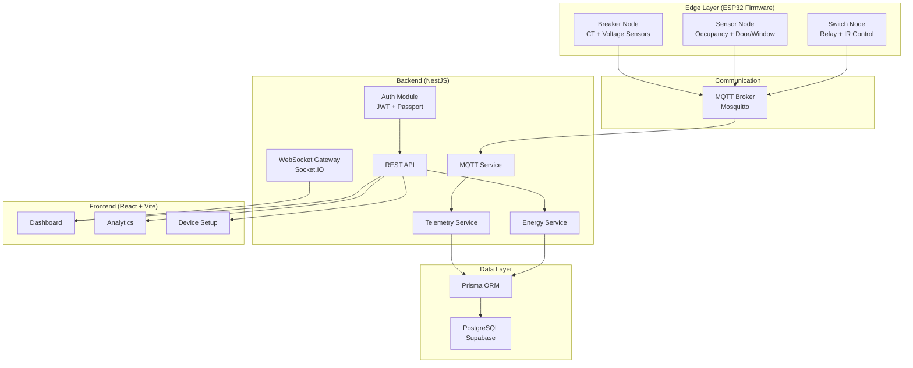
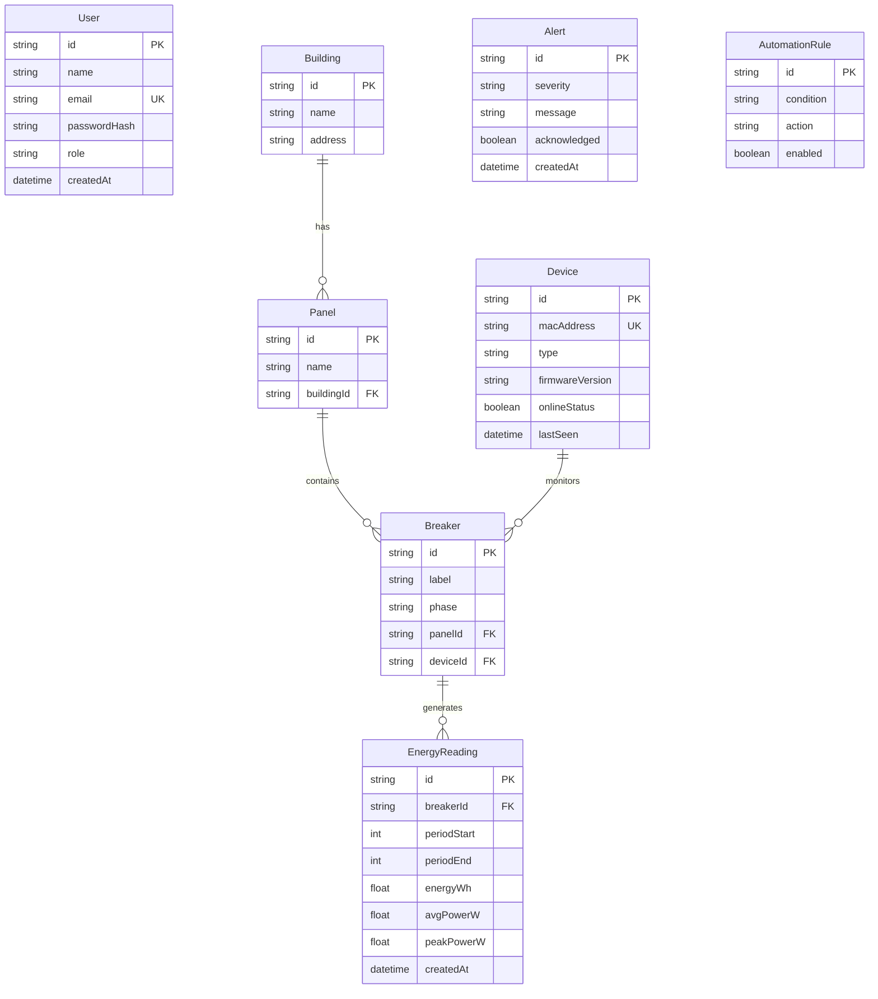

# PowerPulse — Building Energy Management System (BEMS)
## Project Structure & Technology Overview

---

## 🏗️ High-Level Architecture



---

## 📁 Complete Project Structure

```
PowerPulse-Repo/
│
├── Tech stack-overview.md          # Project-level architecture doc
├── docker-compose.yml              # PostgreSQL 15 + Mosquitto (dev infra)
├── mosquitto.conf                  # MQTT broker config
│
├── firmware/                       # ESP32 Arduino C++ firmware
│   ├── breaker-node/               # 🔌 Energy monitoring (CT sensors, voltage)
│   ├── sensor-node/                # 📡 Occupancy + door/window sensors
│   ├── switch-node/                # 🔀 Relay/IR control nodes
│   └── common/                     # 📦 Shared libraries (all empty - scaffolded)
│
├── backend/                        # NestJS API + event processing
│   ├── .env                        # Environment config
│   ├── prisma/
│   │   └── schema.prisma           # Database schema (7 models)
│   ├── prisma.config.ts
│   └── src/
│       ├── main.ts                 # App bootstrap
│       ├── app.module.ts           # Root module (imports all feature modules)
│       ├── app.controller.ts
│       ├── app.service.ts
│       ├── prisma/                 # Prisma client wrapper
│       │   ├── prisma.module.ts
│       │   └── prisma.service.ts
│       ├── auth/                   # JWT authentication (scaffold)
│       │   ├── auth.module.ts
│       │   ├── auth.controller.ts
│       │   └── auth.service.ts
│       ├── users/                  # User management (scaffold)
│       │   ├── users.module.ts
│       │   ├── users.controller.ts
│       │   └── users.service.ts
│       ├── devices/                # Device registry (scaffold)
│       │   ├── devices.module.ts
│       │   ├── devices.controller.ts
│       │   └── devices.service.ts
│       ├── mqtt/                   # ✅ MQTT client (IMPLEMENTED)
│       │   ├── mqtt.module.ts
│       │   └── mqtt.service.ts     # Connects to broker, subscribes, routes messages
│       ├── telemetry/              # ✅ Telemetry ingestion (IMPLEMENTED)
│       │   ├── telemetry.module.ts
│       │   ├── telemetry.controller.ts
│       │   └── telemetry.service.ts # Processes MQTT payloads → EnergyReading
│       └── energy/                 # Energy queries (partial)
│           ├── energy.module.ts
│           ├── energy.controller.ts
│           └── energy.service.ts
│
├── frontend/                       # React + Vite + Tailwind dashboard
│   ├── index.html
│   ├── vite.config.js
│   ├── tailwind.config.js
│   ├── postcss.config.js
│   └── src/
│       ├── main.tsx                # React entry point
│       ├── App.tsx                 # Router with 11 routes
│       ├── App.css
│       ├── index.css
│       ├── layouts/
│       │   └── DashboardLayout.tsx # Sidebar + Topbar wrapper
│       ├── pages/                  # 11 page directories
│       │   ├── Home/
│       │   ├── Login/
│       │   ├── Signup/
│       │   ├── Dashboard/
│       │   ├── DeviceSetup/
│       │   ├── BreakerAssign/
│       │   ├── SwitchNodePairing/
│       │   ├── SensorNodePairing/
│       │   ├── Analytics/
│       │   ├── Alerts/
│       │   └── Settings/
│       ├── components/
│       │   ├── common/             # Sidebar.tsx, Topbar.tsx
│       │   ├── charts/             # (empty)
│       │   └── ui/                 # (empty)
│       ├── context/
│       │   └── ThemeContext.tsx     # Dark/light theme toggle
│       ├── hooks/                  # (empty)
│       ├── services/               # (empty)
│       ├── utils/                  # (empty)
│       └── assets/
│
├── hardware/                       # Schematics, PCB, BOM (empty)
│
└── docs/
    ├── git_workflow.md
    ├── nestjs_bems_backend_architecture_guide.md
    └── tech_stack_and_file_structure_backend_frontend.md
```

---

## 🔧 Technology Stack Details

### Frontend
| Aspect | Technology | Version |
|--------|-----------|---------|
| **Framework** | React | ^19.2.5 |
| **Build Tool** | Vite | ^8.0.10 |
| **Language** | TypeScript | (via tsconfig) |
| **Styling** | Tailwind CSS | ^4.2.4 |
| **Routing** | React Router DOM | ^7.15.0 |
| **PostCSS** | PostCSS + Autoprefixer | ^8.5.14 / ^10.5.0 |
| **Linting** | ESLint | ^10.2.1 |

### Backend
| Aspect | Technology | Version |
|--------|-----------|---------|
| **Framework** | NestJS | ^11.0.1 |
| **Runtime** | Node.js | — |
| **Language** | TypeScript | ^5.7.3 |
| **ORM** | Prisma | ^7.8.0 |
| **Database** | PostgreSQL (Supabase-hosted) | — |
| **Auth** | JWT + Passport | @nestjs/jwt ^11.0.2 |
| **Password Hashing** | bcrypt | ^6.0.0 |
| **MQTT Client** | mqtt.js | ^5.15.1 |
| **WebSocket** | Socket.IO (NestJS gateway) | ^4.8.3 |
| **Validation** | class-validator + class-transformer | ^0.15.1 / ^0.5.1 |
| **Testing** | Jest + Supertest | ^30.0.0 / ^7.0.0 |

### Infrastructure
| Aspect | Technology |
|--------|-----------|
| **MQTT Broker** | Eclipse Mosquitto 2 (Docker) |
| **Database (Dev)** | Docker PostgreSQL 15 |
| **Database (Prod)** | Supabase (PostgreSQL) |
| **Frontend Hosting** | GitHub Pages (planned) |
| **Backend Hosting** | Render (planned) |

### Firmware
| Aspect | Technology |
|--------|-----------|
| **MCU** | ESP32 |
| **Language** | C++ (Arduino framework) |
| **Comms Protocol** | MQTT |
| **Node Types** | Breaker, Sensor, Switch |

---

## 🗄️ Database Schema (Prisma)



**Roles:** Admin, Facility Manager, Technician, Viewer

---

## 📊 Implementation Status

| Component | Status | Notes |
|-----------|--------|-------|
| **Project scaffolding** | ✅ Complete | Monorepo structure in place |
| **Prisma schema** | ✅ Complete | 7 models defined |
| **NestJS modules** | 🟡 Partial | All modules registered, most services empty |
| **MQTT Service** | ✅ Implemented | Connects, subscribes to `bems/+/+/current`, routes to telemetry |
| **Telemetry Service** | ✅ Implemented | Parses MQTT payload → creates `EnergyReading` records |
| **Auth / Users / Devices** | 🔴 Scaffold only | Empty service classes |
| **Energy Service** | 🟡 Partial | Has some query logic |
| **Frontend routing** | ✅ Complete | 11 routes (3 public + 8 dashboard) |
| **Dashboard layout** | ✅ Complete | Sidebar + Topbar + themed |
| **Frontend components** | 🟡 Partial | Sidebar & Topbar built, charts/ui empty |
| **Frontend services/hooks** | 🔴 Empty | No API or WebSocket clients yet |
| **Firmware** | 🔴 Empty | Directory structure only |
| **Hardware** | 🔴 Empty | No schematics yet |

---

## 🔌 MQTT Topic Structure

```
bems/{buildingId}/{deviceId}/current    ← telemetry data (subscribed)
```

**Expected payload:**
```json
{
  "energy_wh": 123.45,
  "avg_power_w": 450.0,
  "peak_power_w": 600.0,
  "period_start": 1715000000,
  "period_end": 1715000060,
  "event": "overcurrent"
}
```

---

## 🔗 Data Flow

```
ESP32 (CT sensor reads) 
  → MQTT publish to bems/{building}/{device}/current
    → Mosquitto broker
      → NestJS MqttService (subscriber)
        → TelemetryService.processTelemetry()
          → Prisma → PostgreSQL (EnergyReading table)
            → REST API / WebSocket → React Dashboard
```

---

## 🚀 Where the Electron Provisioning App Fits

The provisioning app will be a **separate Electron application** that:

1. **Discovers** ESP32 devices (via BLE/serial/mDNS)
2. **Provisions Wi-Fi credentials** to the ESP32
3. **Registers the device** with the backend (via REST API → `Device` table)
4. **Assigns the device** to a Building → Panel → Breaker hierarchy
5. **Configures MQTT** topic/broker settings on the device
6. **Verifies connectivity** (device → MQTT → backend handshake)

This sits as a new top-level directory:
```
project-root/
├── provisioning-app/     ← NEW Electron app
├── firmware/
├── backend/
├── frontend/
├── ...
```
